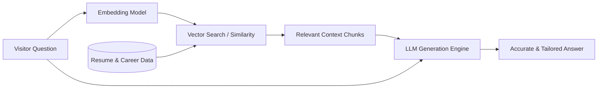

# 🤖 Interactive AI Portfolio & Career Chatbot

An intelligent, interactive portfolio website featuring a **RAG-powered (Retrieval-Augmented Generation)** chatbot. This platform showcases my professional journey, career milestones, technical skills, and work experience, while enabling visitors and recruiters to ask custom questions and receive accurate, context-grounded answers in real-time.

---

## 🌟 Key Features

- **💬 RAG-Powered AI Chatbot**:
  - Ask any question regarding my background, projects, skill set, or work history.
  - Retrieves factual context from ingested documents (resume, project logs, credentials) to minimize hallucinations.
- **🚀 Professional Journey & Milestones**:
  - Interactive timeline highlighting career progression, key achievements, and educational background.
- **🛠️ Skills & Competencies**:
  - Categorized breakdown of programming languages, frameworks, developer tools, and domain expertise.
- **📄 Resume Viewer & Download**:
  - Built-in resume preview with one-click download access.
- **🎨 Modern & Responsive Design**:
  - Sleek, intuitive UI optimized for both desktop and mobile devices.

---

## 🧠 How the RAG Pipeline Works



1. **Document Ingestion**: Resume, detailed project writeups, and career history are processed, chunked, and embedded into a vector store.
2. **Context Retrieval**: When a visitor enters a prompt, the most semantically relevant chunks are retrieved.
3. **Generation**: The language model synthesizes an accurate, professional response using the retrieved knowledge.

---

## 💻 Tech Stack (Suggested)

| Layer | Technologies |
| :--- | :--- |
| **Frontend** | HTML5, CSS3, JavaScript / React / Next.js |
| **Backend & API** | Node.js / Express or Python (FastAPI / Flask) |
| **RAG / AI Orchestration** | LangChain / LlamaIndex, OpenAI / Gemini / Ollama |
| **Vector Storage** | ChromaDB / FAISS / Pinecone |

---

## 📁 Project Structure

```text
my_Website_project/
├── backend/                  # FastAPI & RAG Backend
│   ├── app.py                # Main server (API endpoints + static server)
│   ├── requirements.txt      # Python dependencies
│   ├── data/                 # Ground truth knowledge base
│   │   ├── profile.json      # Structured profile, projects, and skills
│   │   └── resume_data.md    # Markdown knowledge document for RAG chunking
│   └── rag/                  # RAG pipeline logic
│       ├── __init__.py
│       └── engine.py         # Retrieval & semantic response synthesizer
├── frontend/                 # Conversational Portfolio Web Client
│   ├── index.html            # Main website entry point (Chatbot UI)
│   ├── css/
│   │   ├── style.css         # Theme tokens, layout, typography, sidebar
│   │   └── chat.css          # Message bubbles, interactive cards, input area
│   ├── js/
│   │   ├── app.js            # App lifecycle, navigation, event listeners
│   │   ├── chat.js           # Message stream, typing indicator, rich cards
│   │   └── api.js            # API client + client-side RAG fallback
│   └── assets/               # Static assets & docs
│       └── docs/             # Resume PDF directory (resume.pdf)
├── .env.example              # Environment variable template
├── .gitignore                # Git exclusions
├── readme.md                 # Project documentation
└── run.py                    # Unified one-command runner script
```

---

## 🚀 Getting Started

### 1. Quick Run (Instant View)
You can launch the portfolio website immediately using Python:
```bash
python run.py
```
*If FastAPI is not installed yet, it automatically serves the frontend via Python's built-in HTTP server on `http://127.0.0.1:8000`.*

### 2. Full AI Backend Setup
To enable the full Python RAG backend and API endpoints:
```bash
# Install dependencies
pip install -r backend/requirements.txt

# (Optional) Copy environment variables
cp .env.example .env

# Run server
python run.py
```

---

## 📬 Contact & Connect

- **Portfolio**: [Your Website Link](#)
- **LinkedIn**: [Your LinkedIn Profile](#)
- **GitHub**: [Your GitHub Profile](#)
- **Email**: [your.email@example.com](mailto:your.email@example.com)
